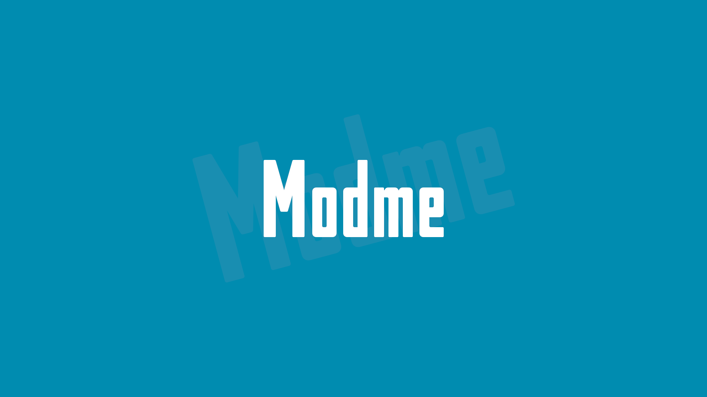

<p align="center">
  <b>Add and remove mods for your favorite games, the fast and simple way</b>
</p>

Modme is an [Ultimate ASI Loader](https://github.com/ThirteenAG/Ultimate-ASI-Loader) plugin. Every mod lives in its own folder, and the game sees the mod's files in place of the originals. Delete the folder and the mod is gone.

## Supported games
- Bully: Scholarship Edition
- Worms Ultimate Mayhem

Other 32-bit games that run [Ultimate ASI Loader](https://github.com/ThirteenAG/Ultimate-ASI-Loader) should work too.

## Installation
1. Install [Ultimate ASI Loader](https://github.com/ThirteenAG/Ultimate-ASI-Loader/releases).
2. Put `Modme.asi` in `Update` (or any UAL plugin folder) with a `Modme` folder next to it.

## Mods
Each folder in `Modme` is a mod whose files mirror the game folder:

```
Modme\HD HUD\TXD\fe1.txd               -> TXD\fe1.txd
Modme\HD HUD\Stream\World.img          -> Stream\World.img
Modme\SilentPatch\SilentPatchBully.asi -> loaded as an ASI plugin
```

- If two mods ship the same file, the first one alphabetically wins.
- Files inside mods are never written to; the game writes to its own copies.
- Files the game expects outside its folder (e.g. `C:\Textures\wall.dds`) can ship as `Modme\Some Mod\Textures\wall.dds` and are used only if the real file is missing.

`Modme.log` next to `Modme.asi` lists loaded mods, conflicts, plugins and replaced files.

## Limitations
- `.img` archives can only be replaced as a whole.

## Building
Visual Studio 2026 with the C++ workload:

```
git clone --recursive https://github.com/sndth/Modme.git
cd Modme
premake5.exe vs2026
```

Open `build\Modme.slnx`, build and run `TestModme`. The tests load `Modme.asi` into a fake game folder and check file redirection, conflicts, plugin loading and the log.

## License
Modme is released under the [MIT](LICENSE) license. It uses [MinHook](https://github.com/TsudaKageyu/minhook) (BSD 2-Clause), [doctest](https://github.com/doctest/doctest) (MIT) for tests and ships [Premake](https://github.com/premake/premake-core) ([BSD 3-Clause](LICENSE-Premake)) for building.